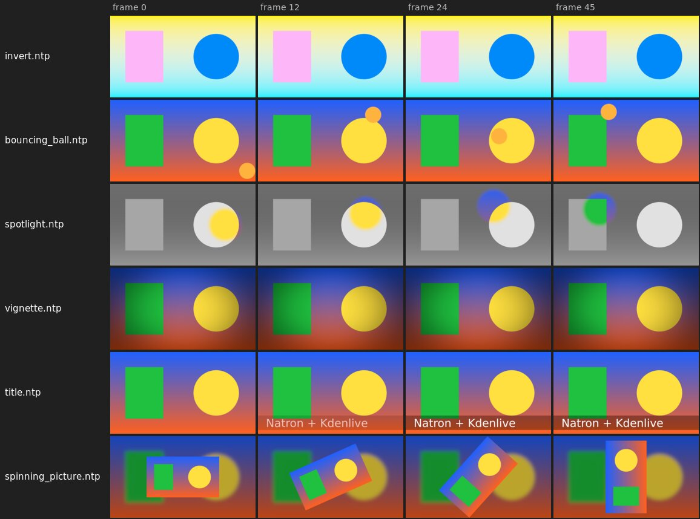

# natron-kdenlive-link

Use Natron compositions as an effect in Kdenlive, in the style of Adobe Dynamic Link ( as used to link Adobe Premiere with After Effects ). Add the **Natron Link** effect to a clip, build the graph in Natron, and see the result in Kdenlive's preview and in rendered files.

> **Status: early development (version 0.5.5, milestone 4 of 6).** The whole chain works on the author's machine: Kdenlive (extracted AppImage) sends frames through the daemon to the real worker inside the Natron snap, and the processed frames come back in Kdenlive's preview and in rendered files. Parameters, nested compositions and other pixel formats are not implemented yet. See [Status and verification](#status-and-verification) for exactly what has and has not been tested.

## What it does

```
Kdenlive (AppImage)                      host                         Natron (snap or tarball)
 MLT filter "natron_link"  --frames-->  natron-kdenlive-daemon  --jobs-->  nkb_natron_worker.py
 (libmltnatron.so)         <--results-- content-hash frame cache <--frames-- renders your .ntp graph
```

* An **MLT filter** inside Kdenlive hashes each frame and asks a local **daemon** whether that frame has already been rendered.
* On a miss, the daemon sends the frame to a **worker** running inside Natron. The worker renders it through your composition (a Natron `.ntp` project) and returns the result.
* Results are cached under a content key (pixels, composition file, parameters, frame number), so a cached frame can never be out of date.
* **Playback stays responsive.** If Natron is slow or not running, the filter shows the original frame, and the render finishes in the background. The next pass over the same frame comes from the cache.
* **Exports wait** for processed frames. If a frame cannot be processed, the log says so (`export_frame_unprocessed`).
* Everything is logged as one structured line per event, so a log can be read by a person or an AI to find out what went wrong.

At about 4 frames per second for a trivial 1080p graph, Natron is the limit, not the bridge. Live playback of heavy graphs is not realistic, which is why the design is cache-first.

## Requirements

| Component | Needed for | Tested with |
|---|---|---|
| Linux, x86_64, X11 desktop | everything | Ubuntu 24.04.4 and Linux Mint (based on Ubuntu 24.04) |
| Build tools | building | g++ 13.3, CMake 3.28, Ninja, git, pkg-config |
| Libraries | building | `libspdlog-dev` 1.12, `libfmt-dev`, `libxml2-dev` |
| Kdenlive | the effect | AppImage 26.08.1, **extracted** (the filter is copied into it; see below why other installs do not work) |
| Natron | rendering, editing compositions | 2.5.0 snap; the 2.5.0 tarball was tested headless |
| MLT 7.40.0 headers | building the filter | built from source into this repository by step B3 below |
| `wmctrl` (optional) | bringing an open Natron window to the front on a second **Open in Natron** click | the Ubuntu package (raising not yet confirmed on the author's machine); X11 only |

The steps below install all of it on a fresh Ubuntu 24.04 or Linux Mint. Each step says what it does, what it must print, and what to do if it does not.

## Folders used in these instructions

Every command block starts with a `# Folder:` line that says where it runs. Blocks that depend on the folder also start with a `cd` into it, so every block can be pasted into any terminal as it is. If you choose other folders, change the paths in the commands.

| Folder | Contents |
|---|---|
| `~/projects-own/natron-kdenlive-link` | This repository: source, `build/` (compiled programs), `third-party/` (the MLT build) |
| `~/apps/kdenlive` | The Kdenlive AppImage and its extracted copy `squashfs-root/` |
| `~/apps/natron` | Only if you use the Natron tarball instead of the snap |
| `~/NatronKdenliveLink` | Created by the programs at run time: `config.ini` (settings), `token` (password between the programs), `logs/` (all log files), `comps/` (Natron compositions), `exchange/` (temporary frames) |

Paste each command block on its own, and wait until it has finished before pasting the next one.

## Installing Kdenlive (the AppImage is required)

The filter is a shared library that is copied into Kdenlive's own MLT module folder. That only works when this folder is writable, which is why the install method matters:

| Kdenlive install | Works with the filter? |
|---|---|
| **AppImage, extracted** | **Yes. This is the tested and supported way.** |
| Snap (`snap install kdenlive`) | No. Its MLT folder is read-only. |
| Flatpak | No. Its MLT folder is read-only inside the sandbox. |
| Ubuntu package (`apt install kdenlive`) | Not tested. Ubuntu 24.04 ships an old Kdenlive and MLT; the filter would have to be copied into a system folder with `sudo`. |

You can keep another Kdenlive installed next to the AppImage, but only the extracted AppImage started with `AppRun` has the filter. A Kdenlive started from your application menu is the other one and does not show the Natron Link effect.

**K1. Create the folder**
```bash
# Folder: any
mkdir -p ~/apps/kdenlive
```

**K2. Download the AppImage** (about 200 MB). If this link no longer works, download the Linux AppImage from https://kdenlive.org/download/ into `~/apps/kdenlive` instead, and use its file name in K3.
```bash
# Folder: ~/apps/kdenlive
cd ~/apps/kdenlive
wget https://download.kde.org/stable/kdenlive/26.08/linux/kdenlive-26.08.1-x86_64.AppImage
```

**K3. Extract it.** This creates `~/apps/kdenlive/squashfs-root`, a normal writable folder with the whole application. It prints a long list of file names and takes a minute.
```bash
# Folder: ~/apps/kdenlive
cd ~/apps/kdenlive
chmod +x kdenlive-26.08.1-x86_64.AppImage
./kdenlive-26.08.1-x86_64.AppImage --appimage-extract > /dev/null
```

**K4. Check it.** Must print a file name ending in `libmlt-7.so.7.41.0` (the MLT version inside Kdenlive 26.08.1).
```bash
# Folder: any
ls ~/apps/kdenlive/squashfs-root/usr/lib/libmlt-7.so.*
```

Always start Kdenlive with `~/apps/kdenlive/squashfs-root/AppRun`, never by running the `.AppImage` file itself: that starts a fresh read-only copy without the filter.

## Installing Natron

Natron needs no changes, so either install method works. The worker runs inside Natron's own Python (`natron -t script.py`), and **Open in Natron** starts the Natron GUI. The snap is what the author uses every day.

### Option A: snap (recommended)

**N1. Install Natron**
```bash
# Folder: any
sudo snap install natron
```

**N2. Check the version.** Must show a line starting with `natron` and version `2.5.0`.
```bash
# Folder: any
snap list natron
```

A snap can only reach non-hidden folders in your home and cannot see other programs' Unix sockets. The defaults handle both: the data folder is `~/NatronKdenliveLink` and the programs talk over loopback TCP (127.0.0.1). Keep your own compositions in non-hidden folders in your home too.

**N3. Start the Natron GUI once by hand** and answer its first-start questions (update check, keyboard shortcuts), then quit it. Otherwise these dialogs appear the first time **Open in Natron** starts it.
```bash
# Folder: any
snap run natron
```

### Option B: official tarball (instead of the snap)

**N1. Install a library Natron needs and wget**
```bash
# Folder: any
sudo apt install -y libglu1-mesa wget
```

**N2. Download and unpack** (about 150 MB)
```bash
# Folder: any
mkdir -p ~/apps/natron
cd ~/apps/natron
wget https://github.com/NatronGitHub/Natron/releases/download/v2.5.0/Natron-2.5.0-Linux-x86_64-no-installer.tar.xz
tar xJf Natron-2.5.0-Linux-x86_64-no-installer.tar.xz
```

The GUI is `~/apps/natron/Natron-2.5.0-Linux-x86_64-no-installer/Natron`, the headless renderer `NatronRenderer` in the same folder. After the first start of the daemon (R2 below) set these two lines in `~/NatronKdenliveLink/config.ini`, in the `[natron]` section (add a line `[natron]` at the end of the file if there is none, then the two lines below it), then restart the daemon:
```
worker_command = /home/YOUR-USER/apps/natron/Natron-2.5.0-Linux-x86_64-no-installer/NatronRenderer
gui_command = /home/YOUR-USER/apps/natron/Natron-2.5.0-Linux-x86_64-no-installer/Natron
```
(`~` is not expanded in `config.ini`; write the full path.) A message `Error while loading OpenGL: X11: Failed to open display` from the headless renderer is harmless. Start the GUI once by hand to answer its first-start questions, as in N3 above.

## Installing wmctrl (optional, recommended)

**W1.** Lets a second click on **Open in Natron** bring the already open Natron window to the front (`raise_command` in `config.ini`). Without it everything else works; the click then only logs `natron_raise_failed`. It needs an X11 desktop (Ubuntu's default "Ubuntu on Xorg" session, Linux Mint Cinnamon); on Wayland it cannot raise windows.
```bash
# Folder: any
sudo apt install -y wmctrl
```

## Building

### B1. Install the build packages

```bash
# Folder: any
sudo apt update
sudo apt install -y build-essential cmake ninja-build git pkg-config libspdlog-dev libfmt-dev libxml2-dev
```

### B2. Get the source

```bash
# Folder: ~/projects-own
mkdir -p ~/projects-own
cd ~/projects-own
git clone https://github.com/anttiraisala/natron-kdenlive-link.git
```

This creates `~/projects-own/natron-kdenlive-link`. If the folder already exists, update it instead, see [Updating to a newer version](#updating-to-a-newer-version).

### B3. Build MLT 7.40.0 (once)

The filter is compiled against MLT's headers. This builds a minimal MLT (only what the filter and its tests need) into `third-party/` inside the repository; git ignores that folder. Kdenlive itself keeps using its own MLT.

**B3a. Download MLT 7.40.0**
```bash
# Folder: ~/projects-own/natron-kdenlive-link
cd ~/projects-own/natron-kdenlive-link
git clone --branch v7.40.0 --depth 1 https://github.com/mltframework/mlt.git third-party/mlt-src
```

**B3b. Configure MLT.** One command over several lines; paste it as a whole. Must end with `-- Build files have been written to: ...`.
```bash
# Folder: ~/projects-own/natron-kdenlive-link
cd ~/projects-own/natron-kdenlive-link
cmake -S third-party/mlt-src -B third-party/mlt-src/build -G Ninja \
  -DCMAKE_BUILD_TYPE=Release -DCMAKE_INSTALL_PREFIX="$HOME/projects-own/natron-kdenlive-link/third-party/mlt-7.40.0" \
  -DBUILD_TESTING=OFF -DGPL=OFF -DGPL3=OFF \
  -DMOD_AVFORMAT=OFF -DMOD_DECKLINK=OFF -DMOD_FREI0R=OFF -DMOD_GDK=OFF -DMOD_GLAXNIMATE_QT6=OFF \
  -DMOD_JACKRACK=OFF -DMOD_KDENLIVE=OFF -DMOD_MOVIT=OFF -DMOD_NDI=OFF -DMOD_NORMALIZE=OFF \
  -DMOD_OLDFILM=OFF -DMOD_OPENCV=OFF -DMOD_OPENFX=OFF -DMOD_PLUS=OFF -DMOD_PLUSGPL=OFF -DMOD_QT6=OFF \
  -DMOD_RESAMPLE=OFF -DMOD_RTAUDIO=OFF -DMOD_RUBBERBAND=OFF -DMOD_RNNOISE=OFF -DMOD_SDL1=OFF \
  -DMOD_SDL2=OFF -DMOD_SOX=OFF -DMOD_SPATIALAUDIO=OFF -DMOD_VIDSTAB=OFF -DMOD_VORBIS=OFF -DMOD_XINE=OFF
```

**B3c. Build and install MLT into `third-party/mlt-7.40.0`** (a few minutes)
```bash
# Folder: ~/projects-own/natron-kdenlive-link
cd ~/projects-own/natron-kdenlive-link
cmake --build third-party/mlt-src/build
cmake --install third-party/mlt-src/build
```

**B3d. Check it.** Must list `libmlt-7.so.7.40.0` (and two links to it).
```bash
# Folder: any
ls ~/projects-own/natron-kdenlive-link/third-party/mlt-7.40.0/lib/libmlt-7.so*
```

### B4. Build the bridge and run the tests

**B4a. Configure** (with the filter: `MLT_ROOT` points at the MLT from B3). Must end with `-- Build files have been written to: ...`.
```bash
# Folder: ~/projects-own/natron-kdenlive-link
cd ~/projects-own/natron-kdenlive-link
cmake -S . -B build -G Ninja -DCMAKE_BUILD_TYPE=Release -DMLT_ROOT="$HOME/projects-own/natron-kdenlive-link/third-party/mlt-7.40.0"
```

**B4b. Build**
```bash
# Folder: ~/projects-own/natron-kdenlive-link
cd ~/projects-own/natron-kdenlive-link
cmake --build build
```

**B4c. Run the tests** (about a minute; no Kdenlive or Natron needed). Must end with `100% tests passed, 0 tests failed out of 3`.
```bash
# Folder: ~/projects-own/natron-kdenlive-link
cd ~/projects-own/natron-kdenlive-link
ctest --test-dir build --output-on-failure
```

The build produces, in `build/`: `natron-kdenlive-daemon` (the daemon), `natron-kdenlive-cache` (status and cache tool), `natron-kdenlive-doctor` (installation check), `libmltnatron.so` (the Kdenlive effect), and test programs. Use `-DCMAKE_BUILD_TYPE=Debug` in B4a while developing. To also run the Natron worker test, add `-DNATRON_COMMAND="snap run natron"` (or the path of `NatronRenderer`) to B4a; see [docs/DETAILS.md](docs/DETAILS.md) for running it by hand.

## Running

### R1. Install the effect into the extracted Kdenlive

Close Kdenlive first. Repeat this step after every update that changes the filter.

```bash
# Folder: ~/projects-own/natron-kdenlive-link
cd ~/projects-own/natron-kdenlive-link
tools/install-filter.sh install ~/apps/kdenlive/squashfs-root
```

It copies `libmltnatron.so` and the effect description `natron_link.xml` into `~/apps/kdenlive/squashfs-root` and checks that the AppImage's own `melt` can load the filter. It must print `OK: the AppImage's MLT loaded libmltnatron.so`.

### R2. Start the daemon

Use a terminal on your desktop (not an SSH session): **Open in Natron** starts Natron windows from the daemon, and they appear on the display of the terminal the daemon was started in.

**R2a. Start the daemon in the background.** It also starts the Natron worker and starts it again whenever it exits, for example after a crash inside Natron. Its output goes to `/tmp/nkb-daemon.out`; everything is also in the log file.
```bash
# Folder: ~/projects-own/natron-kdenlive-link
cd ~/projects-own/natron-kdenlive-link
nohup ./build/natron-kdenlive-daemon > /tmp/nkb-daemon.out 2>&1 &
```

The first start creates `~/NatronKdenliveLink/` with `config.ini`, `token` and `logs/`.

**R2b. Check that the worker is connected.** Wait about 10 seconds after R2a (Natron takes a few seconds to start). Must print `workers=1`.
```bash
# Folder: ~/projects-own/natron-kdenlive-link
cd ~/projects-own/natron-kdenlive-link
sleep 10
./build/natron-kdenlive-cache --status | grep -E "^workers="
```

If it prints `workers=0`: look at `tail -20 ~/NatronKdenliveLink/logs/natron-worker.log` (Natron's own messages) and `grep worker_ ~/NatronKdenliveLink/logs/natron-kdenlive.log | tail -5`. If `natron-kdenlive-cache` says it cannot connect, the daemon is not running: `cat /tmp/nkb-daemon.out` shows why (for example `Address already in use` when an old daemon still runs; stop it as in [Stopping everything](#stopping-everything)).

### R3. Start Kdenlive

```bash
# Folder: any
~/apps/kdenlive/squashfs-root/AppRun
```

### R4. First check: invert a clip with Natron

1. In Kdenlive: **Media > Add Color Clip...** (the menu is called *Project* in older Kdenlive versions), pick a strong color (e.g. green), click OK, and drag the new clip from the **Project Bin** onto track V1 of the timeline.
2. Open the **Effects** tab, type `natron` in its search field, and drag **Natron Link** (under *Misc*) onto the clip on the timeline.
3. Put the timeline cursor on the clip. The effect gets its own composition `comp-xxxxxx`; the clip still looks unchanged (the composition is a pass-through graph).
4. In the effect's panel (Effect/Composition Stack), click **Open in Natron (click to open)**. Natron opens with the clip's frame in its viewer.
5. In Natron's Node Graph there are `Read1` (script name `NKB_Input`: the frame from Kdenlive) and `Write1` (`NKB_Output`: what goes back to Kdenlive). Click into the Node Graph, press **Tab**, type `Invert` and press Enter to create an Invert node. Connect it so the chain is `Read1 -> Invert1 -> Write1`: drag the arrow that enters `Write1` from `Read1` to `Invert1`, and connect `Read1` to the input of `Invert1`. Then, in the Invert node's settings, untick **A** (otherwise alpha is inverted too and the clip becomes transparent, which Kdenlive shows as black).
6. Save in Natron (**Ctrl+S**).
7. Play the clip in Kdenlive. The first pass over each frame may still show the original while Natron renders; the next pass shows the inverted color.

If the clip stays unchanged, see [Troubleshooting](#troubleshooting).

### R5. Optional: test without Natron (test worker that inverts colors)

Stop everything first ([Stopping everything](#stopping-everything)), then:

**R5a. The daemon without the Natron worker**
```bash
# Folder: ~/projects-own/natron-kdenlive-link
cd ~/projects-own/natron-kdenlive-link
nohup ./build/natron-kdenlive-daemon --no-worker > /tmp/nkb-daemon.out 2>&1 &
```

**R5b. The test worker**
```bash
# Folder: ~/projects-own/natron-kdenlive-link
cd ~/projects-own/natron-kdenlive-link
nohup ./build/nkb-mock-worker --mode invert --delay-ms 100 > /tmp/nkb-mock-worker.out 2>&1 &
```

Start Kdenlive as in R3. A clip with the Natron Link effect shows inverted colors after the first pass over each frame.

### Updating to a newer version

Close Kdenlive, then:

**U1. Stop everything** (as in [Stopping everything](#stopping-everything))
```bash
# Folder: any
pkill -9 -f natron-kdenlive-daemon; pkill -9 -f nkb-mock-worker; pkill -9 -f nkb_natron_worker; sleep 1; pgrep -af "natron-kdenlive-daemon|nkb-mock-worker|nkb_natron_worker" || echo "all stopped"
```

**U2. Get the new version**
```bash
# Folder: ~/projects-own/natron-kdenlive-link
cd ~/projects-own/natron-kdenlive-link
git pull
```

**U3. Build and test** (B4a is only needed again if `CMakeLists.txt` changed; it does no harm). Must end with `100% tests passed`.
```bash
# Folder: ~/projects-own/natron-kdenlive-link
cd ~/projects-own/natron-kdenlive-link
cmake --build build
ctest --test-dir build --output-on-failure
```

**U4.** Install the effect again (R1), start the daemon (R2) and Kdenlive (R3). Your settings, compositions and logs in `~/NatronKdenliveLink` are kept.

### Using Natron compositions

**Each effect gets its own composition.** When a newly added Natron Link effect renders its first frame, it picks a new composition name `comp-xxxxxx` (6 random letters and digits) and sets its **Natron project (.ntp)** field to `~/NatronKdenliveLink/comps/comp-xxxxxx.ntp`. The name is saved with the Kdenlive project. The worker creates that file as a default pass-through graph (Read node `NKB_Input` connected to Write node `NKB_Output`) when it renders the first frame for it. Open the file in the Natron GUI, add nodes between the two, and save. The worker reloads the file when it changes, and Kdenlive shows the new result.

The name is picked when the effect renders its first frame, so the timeline cursor has to be over the clip (or the clip has to be played) once. Kdenlive's effect panel does not show the new path right away, because the panel shows its own copy of the values. To see it, switch the effect off and on again with its enable button (observed with Kdenlive 26.08.1). The log also names it: `grep comp_assigned ~/NatronKdenliveLink/logs/natron-kdenlive.log`.

**Animation and frame numbers.** Natron renders each frame at the frame number counted from the start of the effect: Natron frame 0 is the first frame of the clip on the timeline, frame 25 is one second in at 25 fps (for an effect on a track or the master it is the timeline frame). Keyframes set in Natron therefore line up with the clip. **Open in Natron** moves Natron's viewer to the frame Kdenlive showed last. The log line of every frame shows both numbers (`frame=` for Natron, `src_frame=` the position in the source media).

**Alpha matters.** The alpha channel that comes out of the graph is used as is. Several Natron nodes also change alpha by default; for example the **Invert** node inverts R, G, B **and A**, so an opaque clip comes back fully transparent and Kdenlive shows it as black (or shows the track below it). Untick **A** in the Invert node's channel checkboxes to invert only the colors. The same applies to any node whose output looks black: check what it does to alpha. This cannot be repaired after the graph: the Invert node's own **(Un)premult** option (on by default) multiplies the inverted colors by the new alpha 0 inside Natron, so the colors are already gone when the frame leaves Natron.

**Open in Natron.** The effect panel has a checkbox **Open in Natron (click to open)**. Kdenlive effects cannot have push buttons, so this checkbox works as one: every click, ticking or unticking, opens the effect's composition (the file in the **Natron project (.ntp)** field, or the effect's own `comp-xxxxxx`) in the Natron GUI. If the file does not exist yet, a pass-through graph is created first.

* **The clip's current frame is shown in Natron.** On the click the effect saves the frame it showed last as `<comp>_preview.tga` next to the `.ntp`; Natron opens with `NKB_Input` reading that file and a viewer connected to `NKB_Output`. So the effect must have shown a frame first (the timeline cursor over the clip). Natron marks the project as changed (an `*` in the title) because the file names were set; saving keeps them, and the worker uses its own file names for every frame anyway.
* **A second click brings the open Natron window to the front** instead of opening it twice. This uses `wmctrl` (`sudo apt install wmctrl`; X11 desktops). Without it the click only logs `natron_raise_failed`.
* **Auto Previews is turned off.** Open in Natron switches off Natron's node thumbnails (Project Settings > Auto Previews) in the composition before it sets it up: with them on, Natron 2.5.0 hangs for good on graphs that use Python expressions (seen with `examples/title.ntp` and `examples/spinning_picture.ntp`). Natron saves this setting with the project.
* The daemon starts Natron, so it must be running; Natron's window appears on the display of the terminal the daemon was started from. Natron's own messages go to `~/NatronKdenliveLink/logs/natron-gui.log`.
* The command is set in `config.ini`, see [Configuration](#configuration); for the Natron tarball set `gui_command` to the tarball's `Natron`.

**To use another composition**, choose a different `.ntp` with the **Natron project (.ntp)** field, in any folder (for example next to your Kdenlive project, so it is backed up with it); the worker loads exactly that file from the next frame on, and creates it as a pass-through graph if it does not exist yet. The field's file dialog only opens existing files, and Kdenlive 26.08 does not pass text typed into the field on to the effect (observed: the effect kept its old composition). To make a new composition in your project folder: click **Open in Natron**, use Natron's **File > Save Project As...** to save it there (for example `~/Videos/myproject/natron/titles.ntp`), then choose that file with the field's file dialog. (A path written into the project file by hand may also use `~/` for the home folder; a bare name is taken in `~/NatronKdenliveLink/comps/`.) With the Natron snap the folder must be in your home and not hidden (no `.` in the path), because the snap cannot read other places. Several effects can share one composition this way. If you empty the field, the effect goes back to its own `comp-xxxxxx` in `~/NatronKdenliveLink/comps/`.

**Crash protection.** If the worker dies while rendering a composition (Natron crashed) three times in a row, that composition is set aside: its frames pass through unprocessed and the worker is not sent them, so the other clips keep rendering. Saving the composition again in Natron lifts it. The log says `comp_quarantined` and `comp_released`; `natron-kdenlive-cache --status` shows `comps_quarantined`. The limit is `crash_limit` in `config.ini`.

### Example compositions

The folder [`examples/`](examples/) has ready-made compositions that follow the rules above (`NKB_Input` -> your nodes -> `NKB_Output`, output the size of the clip). Each one was rendered through the daemon and the Natron worker by `tests/natron_e2e.sh`.

| File | What it does | Nodes |
|---|---|---|
| `invert.ntp` | Negative image; alpha untouched | Invert (A unticked) |
| `bouncing_ball.ntp` | An orange ball bounces across the picture; the clip shows everywhere around it | Radial (the ball, position by expression) merged over the clip |
| `spotlight.ntp` | Black and white, except inside a soft circle that moves round the picture | Saturation 0, masked by an inverted Radial |
| `vignette.ntp` | Darker corners | Radial (transparent centre, 80 % black edges) merged over the clip |
| `title.ntp` | A "lower third" title: a dark band with the words "Natron + Kdenlive", fading in during the first 25 frames | Rectangle + Text, merged over the clip with an animated mix |
| `spinning_picture.ntp` | The clip at half size, turning slowly, over a blurred and darkened copy of itself | Blur, Grade, Transform (rotation by expression), Merge |



The animations are expressions of `frame` (the frame number counted from the start of the effect, see "Animation and frame numbers"), so they keep going for as long as the clip lasts and start over on every clip that uses them. Positions are pixels of a 1920x1080 frame; with another project size, adjust them in Natron.

**To use an example**, copy the files to a folder of your own first, so that editing them (and the `_preview.tga` / `_output.tga` files that **Open in Natron** writes next to them) does not change the repository:

```bash
# Folder: ~/projects-own/natron-kdenlive-link
cd ~/projects-own/natron-kdenlive-link
mkdir -p ~/NatronKdenliveLink/examples
cp examples/*.ntp ~/NatronKdenliveLink/examples/
ls ~/NatronKdenliveLink/examples/
```

Then, in Kdenlive: add the **Natron Link** effect to a clip, click the folder button of the **Natron project (.ntp)** field, and choose for example `~/NatronKdenliveLink/examples/bouncing_ball.ntp`. Move the timeline cursor over the clip; the first frame takes a few seconds (Natron loads the composition), then play the clip. To change an example, click **Open in Natron**, edit (for example the **Text** field of the Title text node, or the colour of the Ball node), and save with Ctrl+S; Kdenlive shows the change on the next frame it fetches. Several clips can use the same example file; they then share every change. To give one clip its own copy, use Natron's **File > Save Project As...** and choose the new file in that clip's field.

[`examples/make_examples.py`](examples/make_examples.py) builds these files. It documents each graph and is a starting point for writing your own graphs in Python. Running it is only needed after changing it (the command is at the top of the file).

### Stopping everything

```bash
# Folder: any
pkill -9 -f natron-kdenlive-daemon; pkill -9 -f nkb-mock-worker; pkill -9 -f nkb_natron_worker; sleep 1; pgrep -af "natron-kdenlive-daemon|nkb-mock-worker|nkb_natron_worker" || echo "all stopped"
```

It must print `all stopped`. `-9` is used because Natron and `snap run` can ignore the normal stop signal; nothing is lost by it, because the daemon keeps its cache only in memory and the worker saves nothing. `-f` is required: `pkill` without it compares only the first 15 characters of a process name and does not match `natron-kdenlive-daemon`. Natron may leave a `<comp>.ntp.lock` file next to a composition; it is harmless.

## Configuration

The daemon writes a fully commented `~/NatronKdenliveLink/config.ini` on first start. Changes need a daemon restart.

| Key | Default | Purpose |
|---|---|---|
| `[daemon] filter_address` | `tcp:127.0.0.1:47801` | Where Kdenlive filters and tools connect (`tcp:127.0.0.1:PORT` or `unix:/path`) |
| `worker_address` | `tcp:127.0.0.1:47802` | Where the Natron worker connects |
| `cache_memory_mb` | 1024 | Output cache size, kept between `cache_memory_min_mb` (256) and `cache_memory_max_mb` (5120) |
| `input_queue_memory_mb` | 512 | Frames waiting for Natron |
| `buffer_behavior` | `buffer_skip` | When the queue is full: `buffer_skip`, `pause` or `show_cached` |
| `crash_limit` | 3 | A composition that made the worker die this many times in a row is set aside until saved again; 0 = off |
| `natron_timeout_seconds` | 10 | A worker needing longer for one frame is dropped |
| `no_worker_wait_ms` | 0 | How long a request waits while no worker is connected |
| `[natron] start_worker` | `true` | The daemon starts the Natron worker and restarts it when it exits (after 2 s; up to 60 s if it keeps dying) |
| `worker_command` | `snap run natron` | Runs the worker; `-t natron/nkb_natron_worker.py` is added |
| `gui_command` | `snap run natron` | Starts the Natron GUI for **Open in Natron** (with `-c <natron/nkb_gui_open.py>`) |
| `raise_command` | `wmctrl -a` | Brings an open Natron window to the front; the `.ntp` file name is added at the end. Empty = off |
| `scripts_dir` | empty | Folder of `nkb_gui_open.py`; empty = found automatically |
| `[logging] level` | `debug` | `trace`, `debug`, `info`, `warn`, `error` |

Only loopback addresses are accepted. Every connection starts with a token handshake; the token is in `~/NatronKdenliveLink/token` (mode 0600). Loopback TCP is the default because a snap cannot see another snap's Unix sockets.

Filter properties (set in Kdenlive's effect panel or the project file): `ntp`, `comp`, `mode` (`auto`, `playback`, `export`), `playback_timeout_ms` (250), `export_timeout_ms` (600000), `open_natron` (the "button"). In `auto` mode a frame is treated as an export when it is rendered by the `melt` process, which is how Kdenlive renders.

The complete reference, the wire protocol and the Natron findings are in [docs/DETAILS.md](docs/DETAILS.md).

## Logs and diagnostics

All components append to `~/NatronKdenliveLink/logs/natron-kdenlive.log`, one line per event:

```
2026-10-02T21:55:21.208Z [debug] [filter] [t=395393] event=filter_frame comp=comp frame=391 size=1920x1080 mode=playback status=timeout result=passthrough total_ms=259.4 key=61fd22c7...
```

**Follow the log**
```bash
# Folder: any
tail -f ~/NatronKdenliveLink/logs/natron-kdenlive.log
```

**Diagnostics and cache**
```bash
# Folder: ~/projects-own/natron-kdenlive-link
cd ~/projects-own/natron-kdenlive-link
./build/natron-kdenlive-doctor          # configuration, token, addresses, daemon reachability
./build/natron-kdenlive-cache --status  # cache and queue statistics
./build/natron-kdenlive-cache --clear   # drop all cached frames
```

When something fails, the log and the output of `natron-kdenlive-doctor` are enough for a person, or an AI, to diagnose it.

## Troubleshooting

| Symptom | Cause and fix |
|---|---|
| Daemon prints `Address already in use` | An old daemon is still running. Stop it with `pkill -9 -f natron-kdenlive-daemon` |
| "Natron Link" is not in the effects list | Kdenlive needs the module and the effect XML in the extracted AppImage. Re-run `tools/install-filter.sh install ~/apps/kdenlive/squashfs-root`; start Kdenlive with `~/apps/kdenlive/squashfs-root/AppRun`, not the original `.AppImage`. A log line `Invalid metadata for natron_link` means an old module without MLT metadata |
| Clip looks unprocessed | Check `./build/natron-kdenlive-cache --status`. `workers=0` means no worker is connected, and frames pass through. The daemon restarts a crashed worker within seconds; `grep worker_ ~/NatronKdenliveLink/logs/natron-kdenlive.log` shows what happened and `logs/natron-worker.log` Natron's own messages. Also check that the composition is saved (no `*` in Natron's title) |
| A file chosen in the **Natron project (.ntp)** field is not used (the log still shows the old `comp=`) | Kdenlive only passes a value on when it differs from what its panel already holds, and text typed into the field is shown but not passed on. If the field already shows the path you want, clear it with its ✖ button and choose the file again with the file dialog. `grep property_set ~/NatronKdenliveLink/logs/natron-kdenlive.log` shows every value Kdenlive actually set |
| One clip stays unprocessed, others work | `grep comp_quarantined ~/NatronKdenliveLink/logs/natron-kdenlive.log`: that composition crashed Natron three times in a row. Fix the graph in Natron and save it; the next frame is tried again |
| Export is unprocessed | Look for `export_frame_unprocessed` in the log. Start the worker before rendering, or raise `no_worker_wait_ms` |
| Natron snap cannot reach files | The snap sees only non-hidden folders in your home. Keep the exchange folder visible (`NKB_EXCHANGE_DIR`) and use `tcp:` addresses |

## Status and verification

Verified on the author's machines (Ubuntu 24.04.4 and Linux Mint, Kdenlive 26.08.1 AppImage, Natron 2.5.0 snap):

* Build and all tests of the daemon, protocol, cache and tools.
* The filter built against MLT 7.40.0 loads in the Kdenlive 26.08.1 AppImage (MLT 7.41.0), appears in the effects list, processes playback and renders with the test worker, and passes frames through immediately when no worker is connected.
* Natron 2.5.0 snap: the complete worker test (`tests/natron_e2e.sh` over loopback TCP) passes: pass-through accuracy, cache, Invert graph, reload on file change, warm-up, broken composition and recovery, sRGB mode.
* **Milestone 4, the real chain:** Kdenlive 26.08.1 (AppImage) with the real worker in the Natron 2.5.0 snap, 1080p. In one session, 1365 preview frames went through the filter (1099 from the cache, the rest rendered by Natron or passed through while a render was still running) and a Kdenlive render of 78 frames was recognised as an export and fully processed (no `export_frame_unprocessed`). 338 Natron jobs, none failed, about 180 ms per frame.
* Choosing a composition with the effect panel's **Natron project (.ntp)** field, switching between compositions, and editing a composition in the Natron GUI while the worker runs (the worker reloads the saved file and the new result shows up).
* Each new effect gets its own `comp-xxxxxx` composition; the names survive saving and reopening the Kdenlive project.
* **Open in Natron**: Natron opens the effect's composition showing the clip's current frame in the viewer; a second click brings the open window to the front (wmctrl).
* Graphs with Invert, CheckerBoard and CornerPin come back to Kdenlive correctly.
* The daemon starts the Natron worker and restarts it after it is killed or crashes (Natron segfaults were seen in practice; one, caused by the worker's tiny warm-up frame with CornerPin, is fixed).

Verified only in the author's development container:

* The full Natron worker test suite against the headless Natron 2.5.0 tarball: pass-through accuracy, Invert graph, sRGB and raw color modes, reload on file change, broken composition, 1080p timing, compositions in other folders (paths with spaces), CornerPin without the warm-up crash.
* Open in Natron with the real Natron GUI on a virtual display: the composition is created or loaded, the viewer shows the clip's pixels exactly.
* The example compositions in `examples/`: each renders 1920x1080 frames through the daemon and the worker at several frame numbers; their pictures were checked by eye.
* Crash protection: three worker crashes on one composition quarantine it, the worker survives further requests, saving the file lifts it (with a test worker that crashes on purpose).

Not verified on the author's machine yet:

* The example compositions in Kdenlive and in the Natron snap's GUI.
* A composition chosen outside `~/NatronKdenliveLink/comps/` (container tests pass; the snap must be able to read the folder).
* Crash protection with a real Natron crash (the known crash is fixed; tested with a test worker).

Not verified at all:

* Other Kdenlive, MLT or Natron versions, the Kdenlive snap, and other distributions.

### Known limits

* One Natron project is loaded per worker; alternating compositions every frame is slow (a reload takes 60 to 120 ms).
* Only RGBA 8-bit frames are supported so far. The protocol already carries other formats.
* Natron works on premultiplied data. For semi-transparent pixels, use Unpremult, the effect, then Premult. Color precision drops for very low alpha.
* Natron itself can crash on some graphs. The daemon restarts the worker, and a composition that crashes it three times in a row is set aside until it is saved again (see "Crash protection").
* New compositions are created in `~/NatronKdenliveLink/comps/`, not automatically next to the Kdenlive project: an MLT filter is not told where the project file is. To keep one next to the project, save it there with Natron's **Save Project As** and choose it in the **Natron project (.ntp)** field (see "To use another composition").
* Natron 2.5.0 quirks the worker works around: a wrong first render after loading a project (it renders a throw-away frame of the job's size; a tiny one made Natron crash with CornerPin), color spaces reset whenever a filename changes (it sets them for every job), failed renders that do not raise errors, and a crash at interpreter exit (the worker exits with `os._exit`).
* Copying an effect in Kdenlive may copy its composition name too, so both effects share one composition. Choose another file for one of them if that is not wanted.
* A Kdenlive filter attaches to a clip, a track or the master. It cannot add menus, create tracks or act as a true adjustment layer.

## Roadmap

1. Daemon, protocol, cache, tools, test clients (done)
2. MLT filter and Kdenlive effect (done)
3. Natron worker (done)
4. Real end-to-end in Kdenlive with the Natron worker (done); creating and opening compositions from the Kdenlive project, with the compositions next to the project file (not started)
5. Natron parameters and keyframes through Kdenlive's effect panel
6. Nested compositions with cascading invalidation, more pixel formats, disk cache

## Project layout

```
include/nkb/      protocol, sockets, cache, config, client headers
src/              daemon, protocol, network, cache, config, logging
src/filter/       natron_link.cpp (the MLT module)
natron/           nkb_natron_worker.py, make_test_comp.py (run inside Natron)
tools/            cache tool, doctor, test clients, install-filter.sh
data/kdenlive/    effect description for Kdenlive
tests/            unit, end-to-end, filter and Natron worker tests
docs/             detailed reference
examples/         example compositions and the script that builds them (see "Example compositions")
dev-memos/        the developer's own notes and example compositions (see below)
```

## Developer memos

The folder [`dev-memos/`](dev-memos/) holds the developer's own working notes. They are kept in the repository so that they are available to everybody, but they are memos, not maintained documentation, and they may be out of date or specific to the author's machine:

* [`dev-memos/rd.txt`](dev-memos/rd.txt): the commands the author used to install the build packages and to build MLT 7.40.0 into `~/projects-own/kdenlive-natron-bridge/third-party` (the project's old folder name).
* [`dev-memos/comps/`](dev-memos/comps/): example Natron compositions from the author's tests. `comp.ntp` is the default pass-through graph the worker creates (`NKB_Input` -> `NKB_Output`); `invert_rgb.ntp` inverts the colors (Read -> Invert -> Write, with a disabled Ramp node); `invert_rgb2.ntp` is the same graph with the Ramp node enabled, so a gradient is drawn over the inverted image. To try one, copy it to `~/NatronKdenliveLink/comps/` and select it in the effect panel. Natron's project-path setting in these files is written as `~/NatronKdenliveLink/comps`; the bridge does not use it, because the worker sets the input and output file paths itself for every frame.

## Uninstall

**Remove the filter from the extracted Kdenlive** (close Kdenlive first)
```bash
# Folder: ~/projects-own/natron-kdenlive-link
cd ~/projects-own/natron-kdenlive-link
tools/install-filter.sh uninstall ~/apps/kdenlive/squashfs-root
```

**Remove installed programs** (only if you ran `sudo cmake --install build`)
```bash
# Folder: ~/projects-own/natron-kdenlive-link
cd ~/projects-own/natron-kdenlive-link
sudo cmake --build build --target uninstall
```

**Remove all run-time data** (config, token, logs, and your compositions in `comps/`; back them up first)
```bash
# Folder: any
rm -rf ~/NatronKdenliveLink
```

## License

GPL-3.0-or-later, see [LICENSE](LICENSE). You may use, study, modify and redistribute this software, including commercially. If you distribute it, or a modified version, you must do so under the same license and make the source code available.

This project builds on other software that keeps its own licenses: Kdenlive and Natron (GPL), MLT (the framework library is LGPL), spdlog and fmt (MIT). Nothing from Kdenlive or Natron is copied into this repository; the project talks to them through MLT's plugin interface and Natron's Python scripting.
